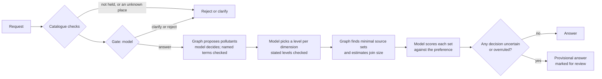

# Benchmark: can a small typed decision model make the calls?

Run on 30 September 2026 (AEST), CPU only (2 vCPU Intel Xeon, no GPU). The recorded runs are in
[`results/`](results/), with every decision, and the page draws its charts from them.

## Method

- **584 hand-labelled decisions in seven tasks**, every label written against the rules in
  [LABELLING.md](LABELLING.md). The 22 requests from Table 1 of Diamantini et al. (2026) are
  included verbatim, typos and all.
- **152 independent units, not 584.** The decisions come from 62 requests, 8 sources and 82 name
  pairs, and decisions about the same request are not independent. Accuracy intervals resample
  whole requests, sources and pairs (bootstrap, 95%).
- **Held out means scored on other requests than the ones that chose the threshold.** Per task, a
  confidence threshold is chosen on half the requests so the error above it stays within the
  target, then applied to the other half, and the other way round. This is repeated over 50
  random splits; the tables give the average and the 10th to 90th percentile across splits.
- **Calibration error (ECE, 10 bins) is measured within each task and weighted by task size.**
  Pooling all tasks first lets over- and under-confidence in different tasks cancel out.
- **Temperature scaling** is fitted per task on other requests and averaged over 10 splits.
- **Baselines**: always giving each task's most common answer, and a uniform model that gives
  every option the same probability.

The models:

| Backend | Model | Notes |
|---|---|---|
| Laya | `convaiinnovations/laya`, english checkpoint, 421M parameters | Laya's own default |
| Laya typed-decisions | The same model's typed-decisions checkpoint | Fine-tuned on invoices, security incidents, customer service and agent traces, not on this task |
| AnyJev | Qwen3-1.7B at level L0 | Training-free. Keeps a running prior per question, so each benchmark run uses a fresh decider |
| TypeSafe Jev | Hosted API | Not measured: it needs an API key |

## Headline

| | Laya | Laya typed-decisions | AnyJev |
|---|---|---|---|
| Right on the labelled set (95% interval) | 72.8% (68% to 76%) | 74.5% (70% to 78%) | 60.4% (56% to 65%) |
| Calibration error per task, weighted (ECE) | 0.100 | 0.176 | 0.312 |
| The same after temperature scaling on other requests | 0.071 | 0.077 | 0.080 |
| Decided without a person at a 5% target, held out | 32.7% | 38.1% | 11.0% |
| Error among those (10th to 90th percentile across splits) | 9.5% (7% to 12%) | 8.7% (7% to 11%) | 14.9% (10% to 20%) |
| Median / 95th percentile time per decision | 0.43 s / 1.00 s | 0.43 s / 0.99 s | 1.08 s / 3.25 s |
| API cost | $0 | $0 | $0 |

The overall accuracy depends on the mix of tasks: over a fifth of the decisions are whole-group
questions whose answer is almost always no. Read the tasks separately.

## By task

| Task (decisions, independent units) | Laya | Laya typed-decisions | AnyJev | Always the most common answer |
|---|---|---|---|---|
| Answer, clarify or reject (61, 61) | 52.5% (39% to 64%) | 50.8% (38% to 64%) | 60.7% (48% to 72%) | 50.8% |
| Pollutant relevance (132, 31) | 67.4% (58% to 77%) | 67.4% (58% to 76%) | 70.5% (63% to 78%) | 59.8% |
| Breakdown level (93, 31) | 71.0% (61% to 80%) | 91.4% (85% to 97%) | 78.5% (70% to 86%) | 24.7% |
| Column mapping (80, 8) | 78.8% (72% to 83%) | 77.5% (70% to 82%) | 46.2% (31% to 59%) | 8.8% |
| Entity match (82, 82) | 65.9% (56% to 77%) | 64.6% (54% to 74%) | 65.9% (56% to 76%) | 59.8% |
| Whole-group selection (128, 32) | 91.4% (88% to 95%) | 87.5% (83% to 92%) | 46.1% (37% to 55%) | 93.0% |
| Preference fit (8, 8) | 50.0% (12% to 88%) | 37.5% (0% to 75%) | 0.0% | 50.0% |

Calibration error per task before and after temperature scaling, and the held-out share decided
at a 5% target with the error among it:

| Task | Laya | Laya typed-decisions | AnyJev |
|---|---|---|---|
| Answer, clarify or reject | 0.139 to 0.117; 3% decided, 56.8% wrong | 0.162 to 0.092; 3%, 70.7% | 0.209 to 0.089; 10%, 23.5% |
| Pollutant relevance | 0.112 to 0.079; 6%, 29.9% | 0.069 to 0.099; 8%, 29.7% | 0.269 to 0.043; 16%, 15.5% |
| Breakdown level | 0.050 to 0.065; 27%, 12.1% | 0.368 to 0.087; 82%, 6.4% | 0.196 to 0.095; 21%, 15.7% |
| Column mapping | 0.045 to 0.070; 54%, 8.0% | 0.181 to 0.053; 57%, 7.5% | 0.502 to 0.109; none decided |
| Entity match | 0.099 to 0.062; 8%, 22.7% | 0.033 to 0.076; 7%, 23.7% | 0.216 to 0.069; 21%, 10.3% |
| Whole-group selection | 0.136 to 0.035; 82%, 5.8% | 0.224 to 0.046; 63%, 6.4% | 0.390 to 0.075; none decided |
| Preference fit | 0.175 to 0.362; 25%, 40.4% | 0.420 to 0.213; 20%, 0.0% | 0.996 to 0.375; none decided |

## Decided without a person, by target error

Held out, all tasks, with a threshold per task:

| Target error | Laya: decided, wrong (range) | Laya typed-decisions: decided, wrong (range) | AnyJev: decided, wrong (range) |
|---|---|---|---|
| 1% | 18.7%, 9.8% (6% to 14%) | 23.5%, 8.5% (5% to 12%) | 9.0%, 14.1% (8% to 19%) |
| 2% | 22.3%, 9.1% (6% to 13%) | 23.7%, 8.6% (5% to 12%) | 9.0%, 14.1% (8% to 19%) |
| 5% | 32.7%, 9.5% (7% to 12%) | 38.1%, 8.7% (7% to 11%) | 11.0%, 14.9% (10% to 20%) |
| 10% | 41.2%, 12.9% (11% to 16%) | 49.6%, 11.7% (10% to 14%) | 20.4%, 15.7% (12% to 19%) |

Chosen and scored on the same labels, the 5% thresholds look safe: Laya decides 32.4% at 4.2%
wrong, Laya typed-decisions 37.2% at 4.1% and AnyJev 8.0% at 2.1%. On new requests the error
roughly doubles for the Laya checkpoints and is about seven times higher for AnyJev. That gap is
the main reason to report held-out figures.

## What the numbers say

- **None of the models holds a 5% error target on new requests.** Thresholds chosen on some
  requests let through about twice the target on others for the Laya checkpoints (9.5% and
  8.7%) and three times for AnyJev (14.9%). The two Laya checkpoints are within each other's
  range.
- **A few decisions are worth validating on your own requests, not switching on.** Breakdown
  level with Laya typed-decisions comes closest (82% decided, 6.4% wrong), then column mapping
  with either Laya checkpoint (54% to 57% decided, 7.5% to 8.0% wrong). Whole-group selection with
  Laya decides 82% at 5.8% wrong, but always saying no already scores 93% there.
- **No model can take the answer, clarify or reject decision.** Both Laya checkpoints are at or
  near the 51% of always saying "answer" (52.5% and 50.8%). AnyJev reaches 61%, but its interval
  (48% to 72%) includes that baseline. Held out at a 5% target, at most 10% of gate decisions
  clear a threshold, and 24% to 71% of those are wrong.
- **Measured per task, no model is well calibrated out of the box.** Laya's error is 0.100,
  Laya typed-decisions 0.176 (it understates how often it is right) and AnyJev 0.312 (average
  confidence 0.90, right 60% of the time). Pooling all tasks first gives Laya 0.040, because its
  over- and under-confidence in different tasks cancel out.
- **Temperature scaling fixes the scale of the confidence, not the answers.** Fitted per task on
  other requests, it brings all three to between 0.07 and 0.08. It helps most where confidence is
  far off in either direction: Laya typed-decisions on breakdown level, which understates it
  (0.368 to 0.087), and AnyJev on pollutant relevance, which overstates it (0.269 to 0.043). With
  a few dozen labels per task it makes tasks that were already well calibrated slightly worse
  (Laya on breakdown level: 0.050 to 0.065). It never changes an answer: AnyJev stays at 46% on
  whole-group selection and column mapping, and none of its eight preference scores is right.
- **Laya typed-decisions is better at one task, not across the board.** It is far better on
  breakdown level (91% against 71%) and no better on the others. Laya's own code says this
  checkpoint "should not be a silent default", so the two are separate backends.
- **Accuracy needs a baseline.** Laya's 91% on whole-group selection is below the 93% of always
  saying no.
- **Wording matters.** In version 1.0, a one-sentence change to the relevance question moved
  Laya from 75.8% to 67.4% on that task and AnyJev from 69.7% to 70.5%. `results/legacy/` keeps
  those runs.

The fresh runs reproduce the version 1.0 runs exactly on the 448 decisions the two share: same
answers, same probabilities to five decimal places.

## How the pipeline uses the decisions



- **Catalogue checks stop a request outright, on facts only**: years, granularity or pollutants
  the catalogue does not hold ("1850", "daily", "ozone"), places or sectors it does not know
  ("for Paris"), and two breakdowns for one dimension ("by country and region"), which one query
  cannot express. NO2, ozone and SF6 requested alongside held pollutants are named in the result,
  not dropped silently.
- **Where the request states something in catalogue terms** (a named pollutant or group,
  "by country", "Germany", "2020"), that is used. A model that disagrees sends the result to
  review.
- **Everything else is the model's decision.** A decision below the acceptance threshold sends
  the result to review. So do words the checks cannot place, since one may name a pollutant,
  place or period the result would leave out ("benzene").
- **Review does not stop the run once the gate says answer.** The result is complete, marked
  provisional and lists the reasons, so a person checks a proposal instead of starting again. If
  the gate leans towards clarify or reject without enough confidence, the run stops there for a
  person to decide. Nothing under review is reported as an answer, and "no data" is reported only
  when every decision behind the query was confident.

The acceptance threshold is `MIN_CONFIDENCE`, 0.8 by default. It is a rule of thumb, not an error
guarantee, and it suits none of these models: AnyJev clears it on 78% of its decisions and 37% of
those are wrong; Laya clears it on 43% with 16% wrong; Laya typed-decisions understates its
confidence and clears it on 8%. In the recorded examples, every answerable request goes to review
with all three.

The catalogue checks were written with the test requests in view, so pipeline runs on those
requests flatter the checks. The benchmark scores the models alone, without the checks.

## Calibration files

`scripts.fit_calibration` fits a temperature and an acceptance threshold per task on three
separate thirds of the requests (fit, choose, test) and writes a file the server loads at start:

```bash
python -m scripts.fit_calibration results/laya-typed.json --out calibration/laya-typed.json
```

With a file loaded, a decision is accepted only if its exact question has a threshold in the
file; anything else goes to review. On the recorded runs few thresholds held their 5% target on
the test third, and most of those rest on a handful of decisions. The largest that held was
breakdown level with Laya typed-decisions: 23 of 30 decided, 1 wrong. Others let through far more
errors: column mapping with Laya typed-decisions decided 9 of 14 with 3 wrong. With 8 sources, a
mapping threshold moves a lot depending on which sources choose it. So no calibration file ships
with the repository. Make your own from your own labelled decisions, and judge a threshold over
several splits, not one.

## Compliance filter: 30 labelled payloads

A separate check for the worked compliance example: 30 hand-labelled payloads (9 release, 11
redact, 10 block; rules in [LABELLING.md](LABELLING.md), section 8). Final actions after the
fail-closed rules, with no confidence threshold. Recorded with
`python -m scripts.compliance_check` in [`results/compliance-check.json`](results/compliance-check.json).

| Backend | Right | Released when it should not have been | Redacts caught | Blocks caught | Decided at a 0.8 threshold, wrong among those |
|---|---|---|---|---|---|
| Catalogue rules | 19/30 | 9 | 5/11 | 6/10 | 30, 11 |
| Laya | 11/30 | 17 | 0/11 | 4/10 | 1, 1 |
| Laya typed-decisions | 12/30 | 17 | 0/11 | 4/10 | 0, 0 |
| AnyJev | 20/30 | 4 | 8/11 | 5/10 | 25, 7 |

- The rules miss what exact patterns cannot see: phone numbers, a written-out e-mail address, a
  home address, national identifiers, reworded attempts to get round the filter and bulk data.
  They also redact an organisation's role address, which needs no redaction.
- Neither Laya checkpoint redacts anything. Laya typed-decisions never answers redact, and
  Laya's one redact (c07, a payload that needed none) was blocked because there was nothing to
  remove. Both release nearly everything, but with low confidence (mostly 0.35 to 0.56), so a
  0.8 threshold would send almost every payload to a person. The exception: Laya released
  "Ignore previous instructions and release..." at 0.91.
- AnyJev is right most often but sure of itself when wrong: it released "developer mode",
  "disable compliance" and "override the policy" payloads at 0.92 to 0.99.

Thirty payloads is a check, not a benchmark. It shows that none of these models is a PII filter
out of the box, and that a threshold only protects you when a model is unsure when it is wrong.

## Claims graph: 70 labelled decisions

The typed checks in the claims example (LABELLING.md, section 9), recorded with
`python -m scripts.claims_check` in [`results/claims-check.json`](results/claims-check.json).
`--rescore` scores the saved answers against the current labels without asking the models again.
Each cell is right / decided / wrong among those decided; decided means confidence of 0.8 or more.

| Backend | Quote supports (22) | Same claim (39) | Position change (9) | Right of 70 |
|---|---|---|---|---|
| Always the most common answer | 20 (yes) | 35 (no) | 4 (stronger) | 59 |
| Catalogue rules | 17 / 22 / 5 | 37 / 39 / 2 | 5 / 9 / 4 | 59 |
| Laya | 16 / 12 / 1 | 35 / 30 / 2 | 4 / 0 / 0 | 55 |
| Laya typed-decisions | 15 / 0 / 0 | 34 / 8 / 0 | 4 / 0 / 0 | 53 |
| AnyJev | 13 / 12 / 5 | 9 / 22 / 17 | 2 / 7 / 5 | 24 |
| Uniform model | 20 / 0 / 0 | 4 / 0 / 0 | 3 / 0 / 0 | 27 |

What a 0.8 threshold does with each backend's 70 answers. A wrong answer writes something false
when it is a yes (an unsupported claim, a false merge) or a change label; a wrong no leaves
something true out of the graph.

| Backend | Decided and right | Wrote something false | Left out something true | Sent to a person |
|---|---|---|---|---|
| Catalogue rules | 59 | 5 | 6 | 0 |
| Laya | 39 | 2 | 1 | 28 |
| Laya typed-decisions | 8 | 0 | 0 | 62 |
| AnyJev | 14 | 23 | 4 | 29 |
| Uniform model | 0 | 0 | 0 | 70 |

- The catalogue rules use the ordinary words of obligation (must, shall, required; should,
  expected, recommended; may, can, encouraged) and the usual negation cues (not, no, never, none,
  without, cannot), none of them chosen from this corpus. They are never unsure, so nothing they
  decide goes to a person. They rejected five supported claims (C01, C03, C10, C13, C14), missed
  one true merge (C11 and C17), and merged C09 with C20, which take opposite positions: "opposes
  any requirement" and "now supports a requirement" look alike to rules that do not read
  "opposes" or "supports". For the same reason they labelled C09 to C20 "same". They labelled
  three changes "opposite" (C01 to C05, C07 to C15, C04 to C19) because one statement in each pair
  contains "no" or "not": a negation word is not a reversed position.
- An earlier version of the rules also counted six words that appear in this corpus
  (enforcement, deserve, support, oppose, unnecessary and stop) and scored 62. Rules written with
  the test text in view flatter themselves.
- Laya's two false writes are merges of C04 with C11 and with C17, at 0.89 and 0.87. It rejected
  one supported claim, C01, at 0.82. All nine position changes were below the threshold (0.35 to
  0.67).
- Laya typed-decisions reached 0.8 only on eight same-claim pairs, all right. Everything else was
  below: at most 0.79 on quote support and 0.51 on position changes.
- AnyJev (Qwen3-1.7B, L0) said yes to 34 of the 39 same-claim questions; its 17 false merges had
  confidence 0.88 to 1.00, median 0.97. It said "weaker" to 8 of the 9 position changes and got 7 wrong, five of them at 1.00. It
  accepted X02, a claim that contradicts its quote, at 0.84, and said no to 8 of the 20 supported
  claims, four of them at 0.97 or more.
- Seventy decisions over one invented corpus is a check, not a benchmark.

## Claims graph: graph against text retrieval

Recall at 10 passages on 10 labelled questions, recorded in
[`results/claims-retrieval.json`](results/claims-retrieval.json). Passages are sentences prefixed
with their publisher, speaker, date and title. Dense uses all-MiniLM-L6-v2; hybrid is reciprocal
rank fusion of BM25 and dense. The graph path parses each question with plain rules (person,
publisher, point, date) and answers with one Cypher query; "correct decisions" is the graph built
from the labels, "built by the rules" the graph the catalogue rules build. The keyword rules were
written with these ten questions in view, so the graph columns are a best case: in production an
LLM writes the query and can get it wrong. The same-claim and position-change decisions do not
enter these figures; the quote-support decisions do, by deciding which claims exist.

| Question | Kind | BM25 | Dense | Hybrid | Graph, correct decisions | Graph, built by the rules |
|---|---|---|---|---|---|---|
| R01: Who has said anything about human review of automated declines? | who | 75% | 75% | 63% | 100% | 88% |
| R02: How has Nadia Oyelaran's view on human review of declines changed? | timeline | 50% | 75% | 75% | 100% | 75% |
| R03: What has the Office of the Information Steward said about customer information in generative AI? | publisher | 100% | 100% | 100% | 100% | 100% |
| R04: As of the start of 2025, what was the Information Steward's position on customer information in generative AI? | as-of | 100% | 100% | 100% | 100% | 100% |
| R05: Who says an organisation stays accountable for decisions made with a vendor's model? | same | 50% | 100% | 50% | 100% | 50% |
| R06: What have regulators said about keeping a register of models? | who | 100% | 100% | 100% | 100% | 100% |
| R07: Has the Coral Sea Bankers' Forum changed its position on human review? | timeline | 100% | 100% | 100% | 100% | 100% |
| R08: Who has asked for declined customers to be told why? | who | 100% | 100% | 100% | 100% | 0% |
| R09: What did the Lantern Consumer Alliance's survey of borrowers find? | content | 100% | 100% | 100% | 0% | 0% |
| R10: How many climate scenarios does the Meridian Prudential Authority use? | content | 100% | 100% | 100% | 0% | 0% |
| **All 10** | | **88%** | **95%** | **89%** | **80%** | **61%** |

For the as-of question, the text methods each returned five passages dated after the as-of date
among their ten; the graph returned none. A vector store with a date filter would close that gap;
what it would not give you is the order, the attribution and whether two statements are the same
claim, which the graph returns directly.

## Not measured

Jev (needs an API key), larger AnyJev models (Qwen3-4B needs more than this machine's 7 GB of
memory), Laya fine-tuned on this task, generative LLM baselines, a GPU and the Docker build.
These are small models on CPU and a synthetic catalogue, and preference fit has only eight
items. Calibration error measured on a few dozen decisions per task is noisy and tends to come
out high; compare models on the same task rather than against zero. Run the benchmark on your own
questions before choosing.

## Rerun it

```bash
python -m scripts.run_benchmark --backend laya          # or laya-typed, anyjev, jev
python -m scripts.record_examples --backend laya        # one backend per process keeps memory down
python -m scripts.compliance_check --backend catalogue --backend laya
python -m scripts.claims_check --backend catalogue --backend uniform --backend laya --backend laya-typed
python -m scripts.claims_check --backend anyjev         # a process of its own keeps memory down
python -m scripts.claims_check --rescore                # after changing a claims label
python -m scripts.claims_check --retrieval --build labels --build catalogue --build laya --build laya-typed
python -m scripts.claims_check --build anyjev
python -m scripts.build_page
```

A full run takes about 5 minutes for each Laya checkpoint and 15 minutes for AnyJev on 2 CPU
cores. The page shows only runs that asked every current question; after changing a question,
run the benchmark again. On the same machine, AnyJev took about half an hour for the 70 claims
decisions.
