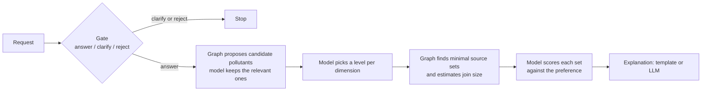

# GraphRAG Decisions Lab

Anthony Lui's graph demo: typed decisions over a synthetic two-layer Kuzu graph, plus a field guide that compares graph databases.

**Jev is the typed decision layer, not the database.** Kuzu holds the graph. Catalogue rules, Laya, AnyJev and TypeSafe Jev make the small fixed choices. An optional LLM only explains scores that were already logged.

## Worked example: a compliance agent in front of another agent

A legal and compliance agent sits in front of a research agent. It filters PII and confidential data before anything is served onward.

| Layer | Role |
|---|---|
| **Jev** (or Catalogue rules / Laya / AnyJev) | Typed decision: release, redact, or block |
| **Kuzu** | Records each decision. The same pattern repeating updates the pattern node, so a second attempt to inject PII is graph state, not a one-off score |
| **Arize** | Eval and cost view: traces, whether the filter was right, and what the decision cost |

In a Watts–Strogatz small-world graph, two hops reach most nodes. That is why a short expansion from the matched pattern is enough context: prior attempts, the filter decision, and the downstream agent.

### What you should see (no keys)

```bash
python -m venv .venv
. .venv/bin/activate
pip install -r requirements.txt
uvicorn app.main:app --host 0.0.0.0 --port 8000
```

Open http://localhost:8000/#compliance and press **Run the example (no keys)**.

1. First payload contains `alex.rivera@example.test`. Catalogue rules **redact** the email. The graph creates a pattern node with **1 attempt**.
2. The second payload tries to circumvent the filter with the same email. Catalogue rules **block** it. The same pattern node now shows **2 attempts**. That is the graph update.
3. The Arize panel shows two traces, filter correctness, and **$0** cost. Credentials are unset, so this is the sample eval fixture plus the traces just recorded. Set `ARIZE_SPACE_ID` and `ARIZE_API_KEY` on the server (never in the repo) if you want live export. Do not commit a `.env`.

TypeSafe Jev stays optional behind `TYPESAFE_API_KEY`. A live call against `https://api.typesafe.ai/v1/systemone` with `jev-latest` (served as `jev-1.13.0`) already succeeded elsewhere. This clone does not invent a key and does not need one.

```bash
curl -s localhost:8000/api/compliance/example -H 'Content-Type: application/json' -d '{"backend":"catalogue"}'
```

## Two pages

| Page | URL | What it is |
|---|---|---|
| **Decisions Lab** | `/` | Compliance example, dataset-discovery pipeline, benchmark, playground. `/api/compare` compares **decision backends**. |
| **Field guide** | `/field-guide` | *Graphs for agent context: a field guide.* Compares **graph databases**: Neo4j, FalkorDB, Neptune, Spanner Graph, PuppyGraph, Fabric graph, MongoDB Atlas, Cosmos DB Gremlin, and Kuzu. |

Catalogue mode already works with no API keys.

## Run the catalogue discovery demo

Same server as above. On http://localhost:8000/ choose **Catalogue rules**. Try `Annual CO2 for Australia in 2024`, `PM10 levels in Lombardy each month`, or `Ammonia from agriculture by country and year`.

```bash
pip install -r requirements-dev.txt
pytest
```

### Docker

```bash
docker build -t graphrag-decisions .
docker run -p 8000:8000 -e API_TOKEN=choose-a-token -v hf-cache:/cache graphrag-decisions
```

The first request to each local model downloads its weights (about 0.8 GB for Laya, 4 GB for Qwen3-1.7B) into the `hf-cache` volume. Catalogue rules need neither. For a GPU image, build with `--build-arg TORCH_INDEX=https://download.pytorch.org/whl/cu126` and run with `--gpus all -e DEVICE=cuda`. For an image with only the API and optional Jev, build with `--build-arg LOCAL_MODELS=false` and set `BACKENDS=catalogue,jev,uniform` only if you also set `TYPESAFE_API_KEY`.

### Optional local models

```bash
pip install torch==2.14.0 --index-url https://download.pytorch.org/whl/cpu
pip install -r requirements.txt -r requirements-local.txt
uvicorn app.main:app --port 8000
```

## What the lab does

The pipeline is the dataset-discovery method of Diamantini et al. (2026), run over a two-layer knowledge graph in Kuzu. A decision model answers each typed question: can the request be answered, which pollutants and breakdowns does it mean, how well does each dataset fit. The graph proposes candidates, expands groups, rolls levels up and finds datasets. An optional LLM only writes the explanation; it never makes a decision.

Three decision backends sit behind one interface, using TypeSafe Jev's question format:

| Backend | What it is | Where the data goes |
|---|---|---|
| **Catalogue rules** | Exact catalogue terms and explicit preferences; no weights | Stays on your server |
| **Laya** | Open 421M-parameter decision model (Apache 2.0) | Stays on your server |
| **AnyJev** | Nokia's training-free layer over an open LLM, here Qwen3-1.7B (Apache 2.0) | Stays on your server |
| **TypeSafe Jev** | Hosted API (commercial), optional | Sent to TypeSafe only if `TYPESAFE_API_KEY` is set |
| Uniform | Every option equally likely, as a reference | Stays on your server |



## Version 1.1 Corrections

The app starts with **Catalogue rules**, a no-weights backend for explicit catalogue requests. Group names are checked explicitly, named places/sectors and date windows reach discovery, and unrelated coverage no longer increases a constrained query's ranking score. Multiple named members must all be covered, even after roll-up.

The model-backed pipeline returns `review` at low-confidence gate, relevance, level or preference decisions. `MIN_CONFIDENCE=0.8` is a heuristic fallback, **not a demonstrated error guarantee**. Relative windows such as "last five years" are explicitly anchored to the synthetic catalogue's latest year, 2025. Unknown preferences in Catalogue rules require review. Supported rule preferences cover official publishers, source-update recency (the oldest constituent of a join), and named member/date coverage. Dimension-specific "as many" preferences require review. Unknown request qualifiers require clarification. When a calibration artifact is loaded, missing question signatures require review rather than falling back to raw confidence.

Laya defaults to `typed-decisions`; the old results below used `english`. Current benchmarks add 128 whole-group items and eight preference-fit items, for **584 decisions in seven tasks**. Entity/mapping remain standalone experiments; pooled accuracy is not end-to-end pipeline accuracy. P15 now requires clarification because NO2 is unheld; historical records keep their original gold labels. The remaining component decisions are still independently labelable.

## Historical Recorded Run

30 September 2026 (AEST), CPU only (2 vCPU Intel Xeon, no GPU), 448 hand-labelled decisions, before the version 1.1 corrections. TypeSafe Jev has not been run: it needs an API key.

| | Laya | AnyJev (Qwen3-1.7B, L0) |
|---|---|---|
| Right on the labelled set | 67.9% | 65.6% |
| Calibration error (ECE, 10 bins) | 0.060 | 0.262 |
| Calibration error after temperature scaling on half the labels | 0.052 | 0.051 |
| Maximum in-sample coverage at 5% empirical error | 13.8% | 0.0% |
| Median time per decision | 0.53 s | 1.41 s |
| API cost | $0 | $0 |

These are original recorded figures, not fresh inference after the corrections. No production risk policy was validated. AnyJev at level L0 is overconfident on this set. These are small models on CPU and a synthetic catalogue. Run the benchmark on your own questions before choosing.

## Configuration

Environment variables, all optional. `.env.example` lists every one with notes. Copy it if you need a local file; do not commit `.env` or key values.

| Variable | Default | Purpose |
|---|---|---|
| `BACKENDS` | `catalogue,laya,anyjev,jev,uniform` | Which backends to build |
| `API_TOKEN` | none | Required bearer token on every POST; also switches on benchmark runs |
| `ALLOWED_ORIGINS` | none | Browser origins allowed to call the API, if the page is hosted elsewhere |
| `TYPESAFE_API_KEY` | none | Enables TypeSafe Jev. Stays on the server. Leave unset. |
| `JEV_PRICE_PER_MTOK` | `0.042` | USD per million input tokens, for cost reporting. Check the current price |
| `DEVICE` | `cpu` | `cuda` on a GPU |
| `ANYJEV_MODEL` | `Qwen/Qwen3-1.7B` | Any causal LM AnyJev supports |
| `ANYJEV_LEVEL` | `L0` | AnyJev calibration level |
| `LAYA_CHECKPOINT` | `typed-decisions` | Explicit Laya checkpoint; historical results used english |
| `CALIBRATION_DIR` | `calibration` | Frozen model/question-matched serving artifacts |
| `MIN_CONFIDENCE` | `0.8` | Heuristic fallback acceptance threshold |
| `LLM_BASE_URL`, `LLM_MODEL`, `LLM_API_KEY` | none | Optional OpenAI-compatible endpoint for explanations |
| `PRELOAD` | `false` | Load local models at start-up |
| `ARIZE_SPACE_ID`, `ARIZE_API_KEY` | none | Optional. When both are set, compliance traces export to Arize. Unset: the example still runs and shows the sample eval fixture. |
| `ARIZE_PROJECT` | `graphrag-compliance` | Arize project name for those traces |

### API

| Method | Path | What it does |
|---|---|---|
| GET | `/api/health` | Version, graph size, which backends are available and why not |
| POST | `/api/decide` | `{backend, state, questions}` with questions in Jev's format |
| POST | `/api/compare` | The same typed question on up to four **decision backends** |
| POST | `/api/pipeline` | `{backend, request, preference}` through the whole pipeline |
| GET | `/api/testset` | The current 584 labelled items |
| GET | `/api/results` | Saved benchmark results, every decision included |
| POST | `/api/eval` | Start a benchmark run; poll `GET /api/eval/{id}` |
| POST | `/api/compliance/example` | Worked PII filter: first attempt plus the repeat. Catalogue needs no keys |
| POST | `/api/compliance/filter` | One payload through the compliance agent |
| GET | `/api/compliance/eval` | Arize eval and cost view (sample fixture if no Arize key) |
| GET | `/api/compliance/graph` | Pattern, attempt and decision nodes after the filter |
| GET | `/api/docs` | Interactive documentation |

The field guide is not this API. It is the `/field-guide` page.

### The pages

The service serves the Decisions Lab at `/` and the field guide at `/field-guide`, so the lab and API share an address and the lab connects by itself. `web/index.html` is self-contained and carries the recorded results. `web/field-guide.html` needs `web/field-guide_files/` beside it. `web/fragment.html` is the lab without its document shell.

Edit `web/template.html`, not `web/index.html`. After a new benchmark run:

```bash
python -m scripts.run_benchmark --backend laya
python -m scripts.record_examples --backend laya --backend anyjev
python -m scripts.build_page
```

## Hosting notes

- **Set `API_TOKEN`** on anything others can reach. Without it, anyone who can reach the server can run the models and spend a Jev budget if a key is present.
- Put the service behind HTTPS.
- Run a single worker. Rate limits and benchmark jobs are kept in memory.
- Kuzu upstream is archived at 0.11.3. The graph is rebuilt in a temporary directory at every start.

## The test set

584 items in seven tasks, with explicit labels against the rules in [LABELLING.md](LABELLING.md). The 22 requests from the paper's Table 1 are included verbatim, typos and all.

## Repository layout

```
app/                 HTTP API, Kuzu graph, pipeline, decision backends
  decisions/         one interface: catalogue, Laya, AnyJev, TypeSafe Jev, uniform
  graph.py           two-layer catalogue graph in Kuzu (read-only after build)
  compliance.py      worked example: legal/compliance agent in front of another agent
  compliance_graph.py writable Kuzu store for filter decisions and repeated patterns
  arize_eval.py      Arize eval/cost export, or the sample fixture when no key is set
  main.py            serves the lab, the field guide, and the API
scripts/             run_benchmark, record_examples, merge_results, build_page
results/             recorded runs
web/                 lab (template.html / index.html) and field-guide.html
web/field-guide_files/   assets required by the field guide
tests/               regression tests; no model weights or vendor calls
```

## Credits

- Pipeline and the 22 paper requests: Diamantini, Mele, Mircoli, Potena, Rossetti and Storti, "A Graph RAG Approach to Enhance Explainability in Dataset Discovery", *Data Science and Engineering* 11:30–52 (2026), doi:10.1007/s41019-025-00313-x, as re-implemented in [Syntran-Labs/paper-rag-graph-4-datasets](https://github.com/Syntran-Labs/paper-rag-graph-4-datasets) (MIT).
- [Laya](https://huggingface.co/convaiinnovations/laya), Convai Innovations, Apache 2.0.
- [AnyJev](https://github.com/nokia-applied-research/AnyJev), Nokia applied research, Apache 2.0; [Qwen3-1.7B](https://huggingface.co/Qwen/Qwen3-1.7B), Apache 2.0.
- [TypeSafe Jev](https://docs.typesafe.ai/), commercial API. Its request format is used here; this project is not affiliated with TypeSafe.
- [Kuzu](https://kuzudb.github.io/), MIT, archived upstream.

The catalogue, its sources and all numbers in it are synthetic.
