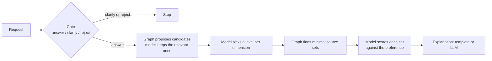

# GraphRAG Decisions Lab

This project is a **knowledge repository and reference implementation** for combining graph context, retrieval, and a typed decision layer. It is not another chatbot demo.

The working claim:

> Graph retrieval plus bounded questions is more reliable than free-form generation over an unbounded context. **Jev is the typed decision layer, not a graph database and not an agent framework.**

Kuzu holds two graphs. Catalogue rules, Laya, AnyJev, and TypeSafe Jev answer the same small fixed questions. An optional LLM only explains scores that were already logged.

The field guide at [`/field-guide`](web/field-guide.html) is a first-class entry: *Graphs for agent context*. Use it to choose graph infrastructure. Use the lab to see typed decisions sit on top of that infrastructure.

Current code version: **1.1.0** (`app/main.py`). The catalogue, its sources, and every number in it are synthetic.

## Start here

1. Install and run Catalogue rules (no API keys).
2. Run the short demo below: compliance filter, then one dataset-discovery request.
3. Skim [architecture](#the-architecture) and [how it works](#how-it-works).
4. Open the [field guide](#field-guide-graphs-for-agent-context).
5. Map the pattern onto your own catalogue or gate in [Adapt it](#adapt-it).
6. Read [evaluation limits](#evaluation) and [security](#security-notes) before treating any figure as a production result.

```bash
python -m venv .venv
. .venv/bin/activate
pip install -r requirements.txt
uvicorn app.main:app --host 0.0.0.0 --port 8000
```

| Page | URL |
|---|---|
| Decisions Lab | http://localhost:8000/ |
| Field guide | http://localhost:8000/field-guide |
| API docs | http://localhost:8000/api/docs |

Catalogue mode needs no keys. Tests: `pip install -r requirements-dev.txt && pytest`.

## The problem

Agents fail in predictable ways:

- Retrieval is uncertain: similar text is not the same as a connected fact.
- Tool use is unbounded: a chat model can return a label you never defined.
- Confidence is unclear: a fluent answer is not a calibrated one.
- Graphs add structure without a decision policy: traversal still has to become *release / redact / block*, or *answer / clarify / reject*.

This lab keeps those jobs separate. The graph proposes candidates and records state. Lexical matching cheaply narrows the catalogue. The decision layer answers typed questions. Evaluation scores those questions against written labels. Illustrations (the Watts–Strogatz ring, the field-guide hop demo) stay labelled as illustrations.

## The architecture

```
User request
      |
      v
Typed decision layer  (Jev wire format)
  catalogue | Laya | AnyJev | TypeSafe Jev | uniform
      |
      +------------------+-------------------+
      |                  |                   |
 Catalogue graph    Compliance graph    Optional Arize
 (Kuzu, read-only   (Kuzu, writable     traces / sample
  after build)       pattern memory)     eval fixture)
      |                  |
 Lexical match      Pattern identity
 + Cypher discover  (hash, not raw PII)
      |
      v
Evidence: ranked datasets, or a filter action
      |
 Explanation (template, or an LLM that never decides)
```

**Jev is the typed decision layer.** You send a state and questions (`noul`, `choice`, `score`) and get label probabilities back. That is the same idea as [Ten Levels of Jev](https://github.com/disler/ten-levels-of-jev): intelligent question answering, programmable through JSON, for gates, routing, and confidence — not a graph store and not an agent runtime. This repository uses that layer *inside* two small workflows. It is not a Jev tutorial and does not implement the later “agent reaches for Jev” levels.

Two different inventories, on purpose:

| Kind | What this repo actually runs | Where else they appear |
|---|---|---|
| **Graph stores** | **Kuzu** only (catalogue + compliance) | The field guide *compares* Neo4j, FalkorDB, Neptune, Spanner Graph, PuppyGraph, Fabric graph, MongoDB Atlas, Cosmos DB Gremlin, and Kuzu. Those other engines are not wired into `app/`. |
| **Decision backends** | Five: Catalogue rules, Laya, AnyJev, TypeSafe Jev, Uniform | `/api/compare` compares these backends, not graph databases. |

This repo does **not** implement vector RAG. Catalogue retrieval is lexical matching plus graph traversal. The field guide’s browser lab contrasts keyword overlap with graph paths; that is a teaching sketch, not an embedding index in this codebase.



The decision model never writes the answer text. The LLM, when configured, never makes a decision.

## Quick demo

No keys. Open http://localhost:8000/#compliance and press **Run the example (no keys)**, or:

```bash
curl -s localhost:8000/api/compliance/example -H 'Content-Type: application/json' -d '{"backend":"catalogue"}'
```

What you should see:

1. First payload contains `alex.rivera@example.test`. Catalogue rules **redact** the email. The graph creates a pattern node with **1 attempt**. Kuzu stores a hashed pattern identity, the decision, and the attempt count — not the raw email.
2. The second payload tries to circumvent the filter with the same email (same pattern identity). Catalogue rules **block**. The same pattern node shows **2 attempts**. Recording the same payload again is idempotent.
3. If the decision backend errors, the filter **fails closed** and blocks; it does not release.
4. The eval panel shows traces and **$0** cost for Catalogue rules. With Arize env vars unset, this is the sample fixture plus the traces just recorded.
5. Open http://localhost:8000/#small-world. That panel is a **synthetic Watts–Strogatz visual** (N=500), not a measurement of this catalogue. See [below](#wattsstrogatz-synthetic-visual).

Then, on http://localhost:8000/, choose **Catalogue rules** and try `Annual CO2 for Australia in 2024`. You should get an answerable query over the synthetic emissions catalogue.

This compliance walkthrough is a lab, not a production filter.

- No measured redaction precision (the catalogue gold is the same regex as the decision).
- No retention policy.
- No live Arize export unless the env vars are set. Arize remains the optional eval and cost view.

## How it works

### Graph layer

Kuzu is embedded. Upstream is archived at 0.11.3; for a graph you keep, swap `app/graph.py` (nothing else talks to the database).

**Catalogue graph** (`app/graph.py`): a two-layer knowledge graph after Diamantini et al. (2026) — pollutants, groups, geographic/time/sector levels, members, sources, columns. It is rebuilt in a temporary directory at every start and is read-only afterwards. Discovery finds minimal source combinations that cover the requested pollutants.

**Compliance graph** (`app/compliance_graph.py`): a separate writable store. Nodes are agents, patterns, attempts, and decisions. Two hops from a matched pattern reach prior attempts, the filter decision, and the downstream agent. Repeats increment the pattern node; the same payload is idempotent.

### Retrieval layer

Not embeddings. The pipeline’s first cut is `lexical_candidates()` in `app/pipeline.py`: pollutants whose names or aliases appear in the request, so the decision model only scores a handful of nodes rather than all 24. Named places, sectors, and date windows are parsed in `app/request.py` and applied as graph filters before roll-up. The graph then expands groups and discovers source sets.

Production retrieval still depends on ranking, evidence quality, and token budgets. A short neighbourhood in a lab graph does not prove that two hops are enough in the wild.

### Decision layer

Every backend implements one interface and Jev’s question shapes (`app/decisions/base.py`):

| Type | Meaning in this lab |
|---|---|
| `noul` | Yes/no: is this pollutant relevant? Do these names match? |
| `choice` | One of a declared set: answer / clarify / reject; release / redact / block |
| `score` | Ordered levels: how well a source set fits a preference |

A choice answer is always one of the labels you declared. That is the point of the layer: code can branch without parsing prose.

| Backend | What it is | Data residency | Needs |
|---|---|---|---|
| **Catalogue rules** | Exact catalogue terms and explicit preferences; no weights | Stays on your server | Nothing |
| **Laya** | Open 421M-parameter decision model (Apache 2.0). Default checkpoint `typed-decisions` | Stays on your server | `requirements-local.txt` |
| **AnyJev** | Nokia’s training-free layer over an open LLM, here Qwen3-1.7B (Apache 2.0) | Stays on your server | local torch / transformers |
| **TypeSafe Jev** | Hosted System One API (commercial) | Sent to TypeSafe only if `TYPESAFE_API_KEY` is set | that key |
| **Uniform** | Every option equally likely; a reference | Stays on your server | Nothing |

Default `BACKENDS` is `catalogue,laya,anyjev,jev,uniform`. Unconfigured backends show as unavailable on `/api/health`; they are not silently used.

Pipeline stages (`app/pipeline.py`):

| Stage | Who decides |
|---|---|
| Gate | Decision model: answer / clarify / reject (plus review on low confidence) |
| Enrich | Graph narrows; model keeps relevant pollutants / groups |
| Query | Model picks a level per dimension |
| Discover | Graph only |
| Rank | Model scores each solution against the preference |
| Explain | Template, or an LLM if `LLM_BASE_URL` and `LLM_MODEL` are set |

`MIN_CONFIDENCE=0.8` is a heuristic fallback, **not a demonstrated error guarantee**. When a calibration artifact is loaded, missing question signatures require review rather than falling back to raw confidence.

The compliance filter is the same layer on a different graph: one `choice` question (release / redact / block), regex detectors for the catalogue backend, fail-closed on backend errors.

## Evaluation

Two evaluations exist. They are not interchangeable.

### Labelled decision set (dataset discovery)

**Current code** (`app/testset.py`, `GET /api/testset`, version **1.1.0**): **584** hand-labelled items in **seven** tasks, against the rules in [LABELLING.md](LABELLING.md). The 22 requests from Diamantini et al. Table 1 are included verbatim. Gold labels for the 128 whole-group items and eight preference items are explicit fixtures, not generated by the live resolver.

| Task | Items | Question |
|---|---:|---|
| Gate | 61 | Answer, clarify, or reject |
| Relevance | 132 | Does the request ask for this pollutant? |
| Level | 93 | Which breakdown, per dimension? |
| Mapping | 80 | Which property does this column hold? |
| Entity | 82 | Do these two names match? |
| Whole-group | 128 | Select a group only when the whole group is named |
| Preference fit | 8 | Narrow ranking regression, not a comprehensive preference benchmark |

Entity and mapping are standalone build-time experiments. **Pooled accuracy is not end-to-end pipeline accuracy.** `evaluation.save()` records `benchmark_scope: "typed decisions, not end-to-end request success"`.

**Recorded model runs in `results/`** are a **different, older slice**: **448** items (the five tasks that existed before the version 1.1 group and fit items), Laya checkpoint **`english`**, AnyJev **Qwen3-1.7B at L0**, finished 29 September 2026 UTC, files with no `pipeline_version`. The API treats them as legacy. Current Laya default is `typed-decisions`. Those JSON files do **not** cover the 128 group + 8 fit items. TypeSafe Jev has **no** committed benchmark in this clone.

On that historical 448-item set, CPU only:

| | Laya (`english`) | AnyJev (Qwen3-1.7B, L0) | Uniform |
|---|---:|---:|---:|
| Top-1 on the labelled set | 67.9% | 65.6% | 38.8% |
| ECE (10 bins) | 0.060 | 0.262 | 0.035 |
| ECE after temperature scaling on half the labels | 0.052 | 0.051 | — |
| Maximum in-sample coverage at 5% empirical error | 13.8% | 0.0% | 0.0% |
| Median time per decision | 0.53 s | 1.41 s | — |
| API cost | $0 | $0 | $0 |

These are original recorded figures, not fresh inference after the 1.1.0 corrections. They are not a claim that “Jev is better.” AnyJev at L0 is overconfident on this set. No production risk policy was validated. Run the benchmark on your own questions before choosing.

```bash
python -m scripts.run_benchmark --backend laya
python -m scripts.record_examples --backend laya --backend anyjev
python -m scripts.build_page
```

Edit `web/template.html`, not `web/index.html`. A new run would write `pipeline_version: "1.1.0"` and, unless you pass `--tasks`, would include all 584 items.

### Compliance filter: rule-consistency check

Catalogue-mode “correctness” is `action == classify(payload)["action"]`. The **same regex** produces the catalogue decision and the gold label (`app/compliance.py`). That is a **rule-consistency check**, not measured filter accuracy. There is no independent gold set in this repository. Do not quote Arize `filter_correct` as precision against human labels.

The sample eval fixture costs $0. Live Arize export runs only when the Arize env vars are set.

### Watts–Strogatz: synthetic visual

The Watts–Strogatz figures are a **synthetic N=500 visual**, not a measurement of this catalogue graph. Token-bounded retrieval is the design claim, not a measured p95. The on-screen example is baked into the page and served at `GET /api/watts-strogatz`. No keys. It is a networking intuition experiment: rewiring a clustered ring shortens path length while clustering stays high, which is why the compliance filter expands a short neighbourhood from the matched pattern.

| Parameter | Value |
|---|---|
| *N* | 500 |
| *K* | 25 |
| Rewiring probability | 0.15 |
| Seed | 1 |
| Rewires | 1,912 |
| Average path length | 2.06 |
| Clustering | 0.464 |

From node 0 on **that ring**: 47 nodes (9%) in 1 hop, 373 (75%) in 2 hops, 499 (100%) in 3 hops. The visual also reports about 22,380 tokens at two hops, 70% of its stated budget. Those hop counts are not statistics of the emissions catalogue.

MathWorks check (average path length on the same cited construction):

| β | MATLAB | This visual |
|---|---|---|
| 0 | 5.48 | 5.48 |
| 0.15 | 2.0715 | 2.0617 |
| 0.5 | 1.9101 | 1.9091 |
| 1 | 1.9008 | — |

NetworkX uses `k=2K`, so the equivalent call is `watts_strogatz_graph(n=500, k=50, p=0.15)`.

- D. J. Watts and S. H. Strogatz, *Collective dynamics of small-world networks*, Nature 393, 440–442 (1998), [doi:10.1038/30918](https://doi.org/10.1038/30918)
- MathWorks, [Build Watts–Strogatz Small World Graph Model](https://www.mathworks.com/help/matlab/math/build-watts-strogatz-small-world-graph-model.html)

**Do not conclude** that two hops are always sufficient, that this catalogue has that topology, or that retrieval complexity is proven by the ring.

## Field guide: graphs for agent context

Open http://localhost:8000/field-guide (source: `web/field-guide.html`).

The page compares **graph databases** for agent context, not decision backends:

Neo4j, FalkorDB, Neptune, Spanner Graph, PuppyGraph, Fabric graph, MongoDB Atlas, Cosmos DB Gremlin, Kuzu 0.11.3, and Kuzu forks.

It includes:

- An interactive hop neighbourhood on a tiny example graph
- Job-specific grades (shared production service vs embedded / per-session memory)
- Criterion scores the page itself labels as **judgement, not measurement**
- Entry production cost bars from vendor list prices **as at 25 September 2026**
- Browser labs: keyword retrieval vs graph paths; PageRank packed into a token budget; a threshold simulation (no model is called)
- The same ownership question in Cypher, Gremlin, GQL, MongoDB, and Kuzu Python
- Local `docker run` / `pip install` snippets for engines that have them

Memgraph is not in this field guide. Grades, prices, and vendor performance claims are not results of this lab’s benchmark. PuppyGraph’s depth score is flagged on the page as unverified vendor figures. Use the guide to choose an engine; this reference implementation still runs Kuzu.

## Adapt it

The reusable pattern is: **typed questions over graph-proposed evidence, with a fail-closed gate**. Three starting shapes this codebase already demonstrates or isolates.

### 1. Catalogue assistant (what the pipeline is)

```
Natural-language request
  → gate (answer / clarify / reject)
  → lexical + graph candidates
  → typed relevance and levels
  → graph discovery
  → typed preference score
  → explanation
```

To point this at your own data: replace `app/domain.py` (entities, sources, coverage) and keep `app/graph.py` as the only database module. Swap Kuzu for another engine there if the field guide says you should. Keep the question schemas in `app/tasks.py`.

### 2. Compliance gate in front of another agent (what the filter is)

```
Inbound payload
  → typed choice: release / redact / block
  → fail closed on backend error
  → store pattern identity + decision, not the raw secret
  → downstream agent sees only what was released or redacted
```

Start from `app/compliance.py` and `app/compliance_graph.py`. Replace the synthetic regex detectors with your own policy, and replace the gold path with an **independent** labelled set before you talk about accuracy.

### 3. Research / planning agent (composition, not a second product)

```
Question
  → planning / gate
  → evidence graph
  → typed checks on the evidence
  → answer
```

This lab does not ship a general research agent. It shows the compliance agent sitting in front of a downstream research role, and the discovery pipeline sitting on a catalogue graph. Compose those: a planner that may only call tools after a gate, and may only cite nodes the graph actually returned.

What not to copy blindly: unsalted pattern hashes as “anonymisation”, catalogue-as-gold compliance scores, or the Watts–Strogatz hop counts as a capacity plan.

## Security notes

- **Do not commit secrets.** Copy `.env.example` locally if you need a file. Do not commit `.env`. Keys stay on the server (`TYPESAFE_API_KEY`, Arize vars, `LLM_API_KEY`).
- **Git history is not clean for a public dump.** Removing secret files from the current tree does not remove them from older commits. Before any public release, decide whether this history can be published; if not, publish a clean mirror, and rotate any credentials that were ever committed. This README does not record those values or those commits.
- **Hashing is identity, not anonymity.** Pattern keys and payloads are fingerprinted with unsalted SHA-256 (`fingerprint()` in `app/compliance.py`). The graph never stores the raw email or SSN. A guessable value (an email, an SSN-shaped string) is still recoverable by dictionary attack. A keyed hash (HMAC) would be more appropriate if this left the lab. Do not describe the current scheme as making values anonymous.
- **Fail closed.** A decision-backend exception blocks the payload. Release is not the fallback.
- **Auth on anything reachable.** Set `API_TOKEN`. Without it, anyone who can reach the server can run models and spend a Jev budget if a key is present. Put the service behind HTTPS. Run a single worker: rate limits and benchmark jobs are in memory.
- **Prompt injection.** The circumvention detector is a small regex for the worked example (`ignore previous`, `do not redact`, …). It is not a prompt-injection defence.
- **State size.** POST bodies are capped (`MAX_STATE_CHARS`). Typed questions are capped (32 questions, 26 choice options, 10 score levels) so backends stay comparable.

## Credits

- Pipeline and the 22 paper requests: Diamantini, Mele, Mircoli, Potena, Rossetti and Storti, “A Graph RAG Approach to Enhance Explainability in Dataset Discovery”, *Data Science and Engineering* 11:30–52 (2026), doi:10.1007/s41019-025-00313-x, as re-implemented in [Syntran-Labs/paper-rag-graph-4-datasets](https://github.com/Syntran-Labs/paper-rag-graph-4-datasets) (MIT).
- [Laya](https://huggingface.co/convaiinnovations/laya), Convai Innovations, Apache 2.0.
- [AnyJev](https://github.com/nokia-applied-research/AnyJev), Nokia applied research, Apache 2.0; [Qwen3-1.7B](https://huggingface.co/Qwen/Qwen3-1.7B), Apache 2.0.
- [TypeSafe Jev](https://docs.typesafe.ai/), commercial API. This project uses its question format; it is not affiliated with TypeSafe. The embedding-into-workflows framing follows [Ten Levels of Jev](https://github.com/disler/ten-levels-of-jev) (disler) without reproducing that lab.
- [Kuzu](https://kuzudb.github.io/), MIT, archived upstream.
- D. J. Watts and S. H. Strogatz, *Collective dynamics of small-world networks*, Nature 393, 440–442 (1998), doi:10.1038/30918.
- MathWorks, [Build Watts–Strogatz Small World Graph Model](https://www.mathworks.com/help/matlab/math/build-watts-strogatz-small-world-graph-model.html).
- Watts–Strogatz on-screen figures follow Anthony Lui’s cited lab notes (N=500, K=25, p=0.15, seed 1).

## Licence

**This repository currently has no licence file.** Until one is added, no licence is granted by this README: others should not assume they may copy, modify, or redistribute the work.

*Proposal, not a grant:* if the project is published, MIT would match the Diamantini reimplementation and Kuzu lineage. Laya, AnyJev, and Qwen3-1.7B remain Apache 2.0 regardless. Adding a `LICENSE` file is a separate legal act; this paragraph is not one.

## Configuration

All optional. `.env.example` lists every variable.

| Variable | Default | Purpose |
|---|---|---|
| `BACKENDS` | `catalogue,laya,anyjev,jev,uniform` | Which backends to build |
| `API_TOKEN` | none | Required bearer token on every POST; also switches on benchmark runs |
| `ALLOWED_ORIGINS` | none | Browser origins allowed to call the API, if the page is hosted elsewhere |
| `TYPESAFE_API_KEY` | none | Enables TypeSafe Jev. Stays on the server. Leave unset unless you have a key. |
| `JEV_PRICE_PER_MTOK` | `0.042` | USD per million input tokens, for cost reporting only. Check the current price. |
| `DEVICE` | `cpu` | `cuda` on a GPU |
| `ANYJEV_MODEL` | `Qwen/Qwen3-1.7B` | Any causal LM AnyJev supports |
| `ANYJEV_LEVEL` | `L0` | AnyJev calibration level (`raw` or `L0`) |
| `LAYA_CHECKPOINT` | `typed-decisions` | Historical recorded results used `english` |
| `CALIBRATION_DIR` | `calibration` | Frozen model/question-matched serving artifacts |
| `MIN_CONFIDENCE` | `0.8` | Heuristic fallback acceptance threshold |
| `LLM_BASE_URL`, `LLM_MODEL`, `LLM_API_KEY` | none | Optional OpenAI-compatible endpoint for explanations |
| `PRELOAD` | `false` | Load local models at start-up |
| `ARIZE_SPACE_ID`, `ARIZE_API_KEY`, `ARIZE_PROJECT_NAME` | unset / `graphrag-compliance` | Optional live trace export. Unset: sample eval fixture. |
| `RESULTS_DIR` | `results` | Saved benchmark JSON |
| `MAX_STATE_CHARS` | `4000` | POST state size cap |
| `RATE_LIMIT_PER_MINUTE` | `120` | In-memory per-client limit |

### Optional local models

```bash
pip install torch==2.14.0 --index-url https://download.pytorch.org/whl/cpu
pip install -r requirements.txt -r requirements-local.txt
uvicorn app.main:app --port 8000
```

### Docker

```bash
docker build -t graphrag-decisions .
docker run -p 8000:8000 -e API_TOKEN=choose-a-token -v hf-cache:/cache graphrag-decisions
```

The first request to each local model downloads its weights (about 0.8 GB for Laya, 4 GB for Qwen3-1.7B) into the `hf-cache` volume. Catalogue rules need neither. For a GPU image, build with `--build-arg TORCH_INDEX=https://download.pytorch.org/whl/cu126` and run with `--gpus all -e DEVICE=cuda`. For an image with only the API and optional Jev, build with `--build-arg LOCAL_MODELS=false` and set `BACKENDS=catalogue,jev,uniform` only if you also set `TYPESAFE_API_KEY`.

### API

| Method | Path | What it does |
|---|---|---|
| GET | `/api/health` | Version, graph size, which backends are available and why not |
| POST | `/api/decide` | `{backend, state, questions}` with questions in Jev's format |
| POST | `/api/compare` | The same typed question on up to four **decision backends** |
| POST | `/api/pipeline` | `{backend, request, preference}` through the whole pipeline |
| GET | `/api/testset` | The current labelled items (584 in version 1.1.0) |
| GET | `/api/results` | Saved benchmark results, every decision included |
| POST | `/api/eval` | Start a benchmark run; poll `GET /api/eval/{id}` |
| POST | `/api/compliance/example` | Worked PII filter: first attempt plus the repeat |
| POST | `/api/compliance/filter` | One payload through the compliance agent |
| GET | `/api/compliance/eval` | Eval and cost view (sample fixture if no Arize key) |
| GET | `/api/compliance/graph` | Pattern, attempt and decision nodes after the filter |
| GET | `/api/watts-strogatz` | Cited small-world visual (N=500). No keys |
| GET | `/api/docs` | Interactive documentation |

The field guide is the `/field-guide` page, not this API.

### Repository layout

```
app/                 HTTP API, Kuzu graphs, pipeline, decision backends
  decisions/         one interface: catalogue, Laya, AnyJev, TypeSafe Jev, uniform
  graph.py           two-layer catalogue graph in Kuzu (read-only after build)
  compliance.py      legal/compliance agent in front of another agent
  compliance_graph.py writable Kuzu store for filter decisions and repeated patterns
  watts_strogatz.py  cited N=500 small-world visual (not this catalogue)
  arize_eval.py      optional live export, or the sample fixture
  main.py            serves the lab, the field guide, and the API
scripts/             run_benchmark, record_examples, merge_results, build_page
results/             recorded runs (legacy 448-item files unless re-run)
web/                 lab (template.html / index.html) and field-guide.html
tests/               regression tests; no model weights or vendor calls
LABELLING.md         gold-label rules for the 584-item set
```

`web/index.html` is generated and carries recorded results. `web/fragment.html` is the lab without its document shell. `web/field-guide.html` is self-contained (fonts match the lab page).
